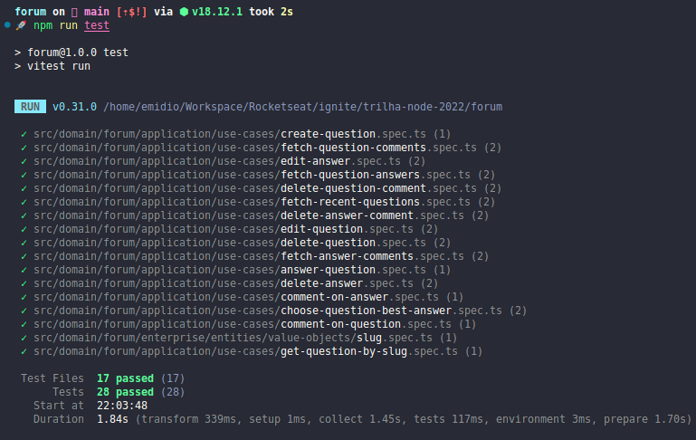

# Forum 💬

<p align="center">
  🚧
  
  🚧
</p>

<p align="center">
  
  
  
</p>

A aplicação **Forum** é um fórum online desenvolvido utilizando Node.js, que permite que alunos enviem dúvidas para serem respondidas por outros alunos ou professores.

Através do **Forum**, os professores têm acesso às dúvidas dos alunos, podendo identificar quais delas já foram respondidas e quais ainda estão em aberto. Os alunos podem interagir entre si e com os professores, contribuindo para uma comunidade de aprendizado colaborativa.

Recursos e funcionalidades principais da aplicação:

- **Envio de Dúvidas**: Os alunos podem enviar suas dúvidas para o fórum, descrevendo detalhadamente o problema ou a pergunta.
- **Respostas de Alunos e Professores**: Tanto alunos quanto professores podem responder às dúvidas dos alunos, oferecendo soluções, explicações ou orientações.
- **Melhor Resposta**: O autor da dúvida tem a opção de escolher qual resposta foi a mais útil ou solucionou seu problema, destacando-a como a "melhor resposta".
- **Comentários em Perguntas e Respostas**: Os internautas podem enviar comentários tanto para as perguntas quanto para as respostas existentes, permitindo discussões adicionais e esclarecimentos.

Através da utilização do Node.js, a aplicação é capaz de lidar com um alto volume de requisições de forma eficiente e escalável, garantindo uma experiência rápida e responsiva aos usuários.

O **Forum** é uma ferramenta valiosa para promover a interação e a troca de conhecimento entre alunos e professores, proporcionando um ambiente colaborativo de aprendizado.

## 🧭 Como rodar o projeto

Instale as dependências

```bash
npm install
```

---

## 🧪 Testes

Utilize o comando a seguir para executar os testes unitários

```bash
npm run test
```



Utilize o comando a seguir para executar os testes unitário em modo watch

````bash

```bash
npm run test:watch
````
